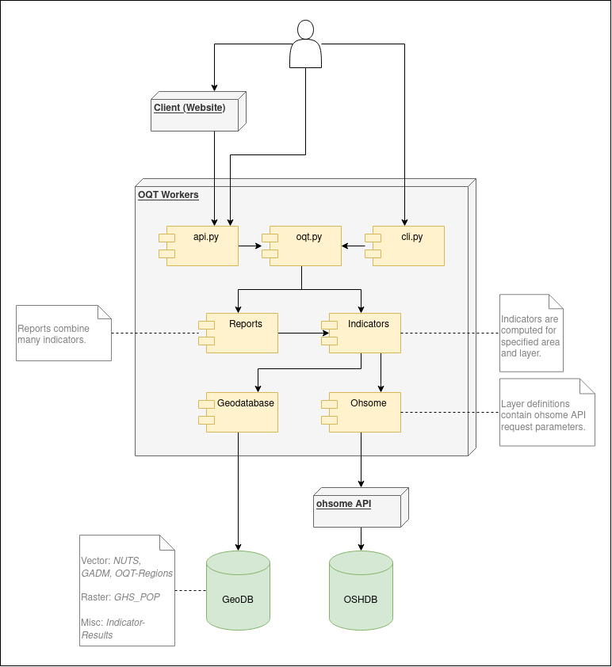

# ohsome quality analyst

## Vision

What is OQT?
* A project that **formalizes the knowledge on OSM data quality** within HeiGIT and the GIScience Research Group.
* A tool that end users, e.g. humanitarian organisations and public administration, can use to get information on the **quality of OSM data for their specific region and use-case**.
* A **web app** that builds upon the existing infrastructure, especially [ohsomeHeX](https://ohsome.org/apps/osm-history-explorer) and the [ohsome dashboard](https://ohsome.org/apps/dashboard).
* A **data integration tool**, that brings together the implementation of a variety of intrinsic and extrinsic data quality metrics.


## Components

1. Database: PostGIS database
2. Workers/Back-end: Python package ohsome_quality_analyst
3. Website




## Installation

End users should use the [website](https://oqt.ohsome.org). Following section is for advanced usage of ohsome quality analyst. To set the project up for development, please refer to [docs/development_setup.md](docs/development_setup.md).

Python 3.8 is required.

Install the ohsome_quality_analyst Python package.

```bash
cd workers
pip install .
```

In addition to installing the Python package, access to the PostGIS database is required. Please reach out if you need one.


## Usage of the Command Line Interface

```bash
$ oqt --help
Usage: oqt [OPTIONS] COMMAND [ARGS]...

Options:
  --version    Show the version and exit.
  -q, --quiet  Disable logging.
  --help       Show this message and exit.

Commands:
  create-all-indicators  Create all indicators for a specified dataset.
  create-indicator       Create an Indicator and print results to stdout.
  create-report          Create a Report and print results to stdout.
  list-datasets          List in the Geodatabase available datasets.
  list-indicators        List available indicators and their metadata.
  list-layers            List available layers and how they are definied...
  list-reports           List available reports and their metadata.
```


## Contributing

Please refer to [CONTRIBUTING.md](CONTRIBUTING.md).


## Development Setup

Please refer to [docs/development_setup.md](docs/development_setup.md).

