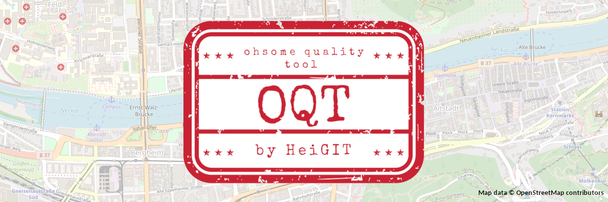

# Proof of Concept for Ohsome Quality Tool

## Vision

What is OQT?
* A project that **formalizes the knowledge on OSM data quality** within HeiGIT and the GIScience Research Group
* A tool that end users, e.g. humanitarian organisations and public administration, can use to get information on the **quality of OSM data for their specific region and use-case**.
* A **web app** that builds upon the existing infrastructure, especially ohsome-hex and the ohsome dashboard
* A **data integration tool**, that brings together the implementation of a variety of intrinsic and extrinsic data quality metrics

For more information check [Confluence](https://confluence.gistools.geog.uni-heidelberg.de/display/oshdb/The+ohsome+Quality+Tool).

## Components

1. Database: PostGIS database
2. Workers/Back-end: Python package ohsome_quality_analyst
3. Website

## Contributing

Please refer to [CONTRIBUTING.md](CONTRIBUTING.md)
