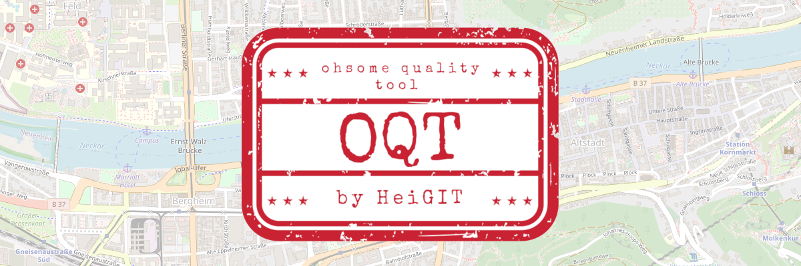
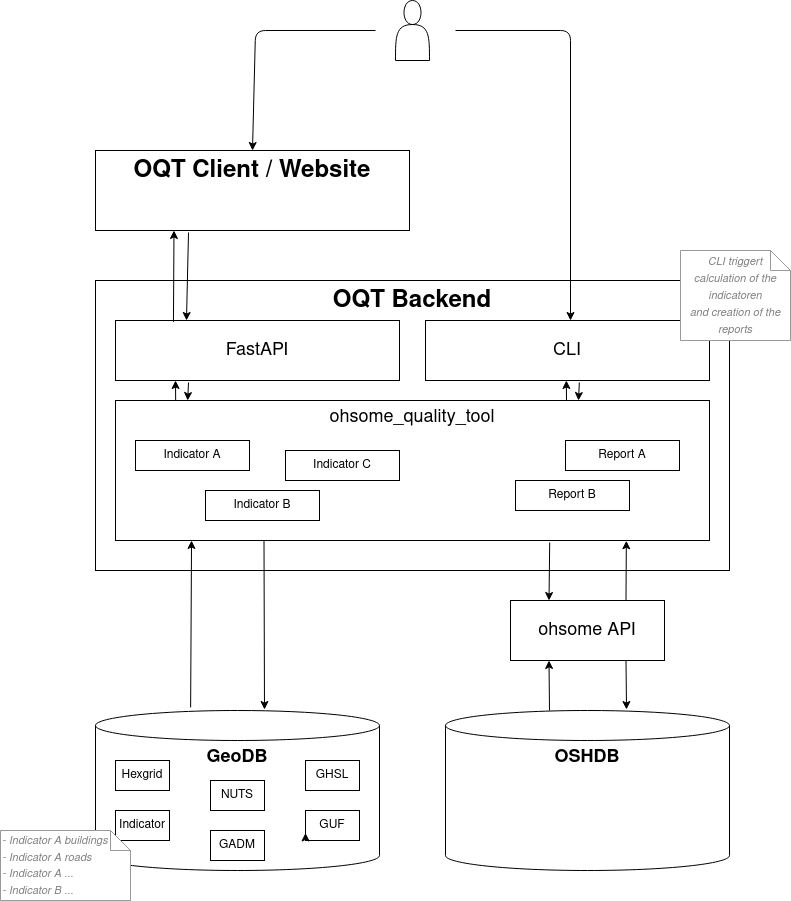

# Proof of Concept for Ohsome Quality Tool

## Vision

What is OQT?
* A project that **formalizes the knowledge on OSM data quality** within HeiGIT and the GIScience Research Group
* A tool that end users, e.g. humanitarian organisations and public administration, can use to get information on the **quality of OSM data for their specific region and use-case**.
* A **web app** that builds upon the existing infrastructure, especially ohsome-hex and the ohsome dashboard
* A **data integration tool**, that brings together the implementation of a variety of intrinsic and extrinsic data quality metrics

For more information check [Confluence](https://confluence.gistools.geog.uni-heidelberg.de/display/oshdb/The+ohsome+Quality+Tool).


## Setup and Contributing

Please see [Contributing Guidelines](CONTRIBUTING.md) for how to setup and how to contribute.

For the production setup of the database see: [database/README.md](database/README.md).


## Usage of Command Line Interface

Run the following line to get an overview:
```
oqt --help
# and/or
oqt list-indicators
# and/or
oqt list-layers
```

Run the following line to derive the `GHSPOP_COMPARISON` indicator:
```
oqt --verbose get-dynamic-indicator -i GHSPOP_COMPARISON --infile data/heidelberg_altstadt.geojson 
```

Run the following line to derive the `SKETCHMAP_FITNESS` report:
```
oqt --verbose get-dynamic-report -r SKETCHMAP_FITNESS --infile data/heidelberg_altstadt.geojson
```


## API

Run the following line to start the server:
```
uvicorn ohsome_quality_tool.app.main:app --reload
```

Go to [http://127.0.0.1:8000/docs](http://127.0.0.1:8000/docs) and check out the endpoints.


## Docker

You can also run the tool using docker, e.g. if you have problems installing on Windows. For now this will run the api at http://127.0.0.1:8000/docs. The website will be served at http://127.0.0.1:8080. This should be enough to test that the installation worked.

```
docker-compose up -d oqt-workers oqt-website
```

You can run a cli command using the docker image like this:
```
docker-compose run oqt-workers oqt --verbose get-dynamic-indicator -i GHSPOP_COMPARISON --infile data/heidelberg_altstadt.geojson
```

> NOTE: For the production setup of the Geodatabase please refer to [ohsome_hex_db/README.md](ohsome_hex_db/README.md).


## Components




