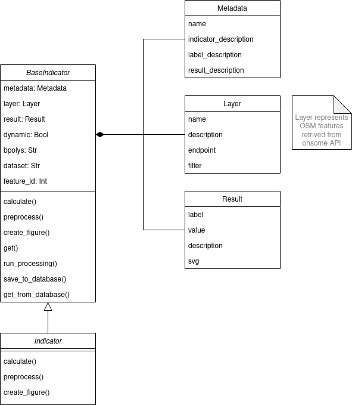

## Indicator Creation Guide

To make contribution to the OQT easier we have compiled this guide which explains the parts that are needed to built an indicator. 
If you want to create an indicator you need to create **two** files in a folder named after your indicator which is placed in **ohsome_quality_tool/indicators** e.g. ohsome_quality_tool/indicators/your_indicator_name. 
The two files are named:

1. **metadata.yaml**
2. **indicator.py**

### metadata.yaml
The metadata.yaml holds basic information about your indicator e.g. the indicator name, a quick description on what it does and how it works and a standartized interpretation of it's possible results. 
The easiest way to setup the metadata.yaml the right way would be to copy it from another indicator and to replace the texts with your own. Just don't replace or change the category names.

### indicator.py
To illustrate the structure of an indicator we created a Class Diagram showing it's most important components. 

  

As you can see the indicator you are trying to create should inherit from BaseIndiactor. This class takes care of most of the needed functionality. Each Indicator consists of 3 base Elements. 

#### Metadata
The metadata is automatically loaded from it's corresponding metadata.yaml file. During creation of your indicator.py you just need 

 Layer and Result. The Metadata is automatically loaded from it's metadata.yaml, the layer can be set during object creation and the result saves the result of a Indicator instance.
