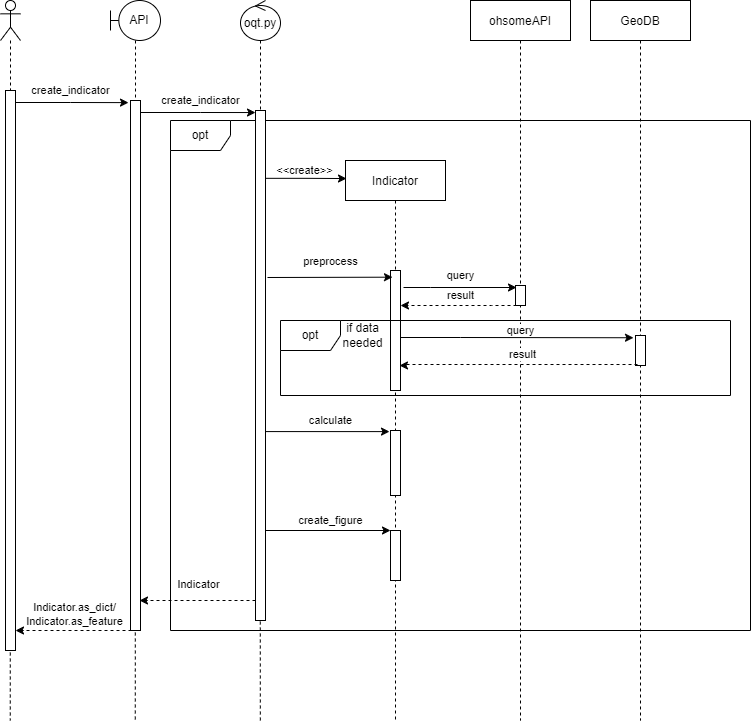

# Indicator Creation Guide

To make contributions to the OQT easier we have compiled this guide which explains the components and background knowledge that are needed to build an indicator.<br>
To understand how to implement your own indicator, it is necessary to know a few things about how the BaseIndicator works and how it is composed. This will be covered in the first part. The second part will give further guidelines on how to implement your own Indicator.


## 1. BaseIndicator

To illustrate the structure of an indicator we created a Class Diagram showing its most important components. 


As you can see, the indicator you are trying to create should inherit from BaseIndicator. This class takes care of most of the needed functionality. The BaseIndicator is built from three elements: Result, Metadata and Layer, and some utility functions. The Metadata is automatically loaded from its corresponding metadata.yaml (see part 2), the layer can be set during object creation, and the result saves the result of an Indicator instance. 


### Result

The result object can hold 4 values. 

1. label: This should be a member of `TrafficLightQualityLevels` found in [workers/ohsome_quality_analyst/utils/definitions.py](/workers/ohsome_quality_analyst/utils/definitions.py)
2. value: TBD
3. description: label description for `TrafficLightQualityLevel` (see metadata.yaml in part 2)
4. svg: unique file path which is **automatically** created upon object initialization by the `BaseIndicator`


### Layer

In the OQT we used the term Layer to describe the result of an ohsome API query. If you need a custom layer from the ohsome API, you can specify new layers in [workers/ohsome_quality_analyst/ohsome/layer_definitions.yaml](/workers/ohsome_quality_analyst/ohsome/layer_definitions.yaml). The layers are defined with 4 Attributes. A name and a description for documentation purposes and the ohsome API [endpoint](https://docs.ohsome.org/ohsome-api/stable/endpoints.html) as well as [filters](https://docs.ohsome.org/ohsome-api/stable/filter.html) for functionality.


### Metadata

See metadata.yaml in part 2.


## 2. Your own Indicator

If you want to create an indicator you need to create **two** files in a folder named after your indicator which is placed in **ohsome_quality_analyst/indicators** e.g. ohsome_quality_analyst/indicators/your_indicator_name.

The two files are named:

1. **metadata.yaml**
2. **indicator.py**


### metadata.yaml

The metadata.yaml holds basic information about your indicator e.g. the indicator name, a quick description on what it does and how it works, and a standardized interpretation of its possible results.

The easiest way to set the metadata.yaml up the right way would be to copy it from another indicator and to replace the texts with your own. Just don't replace or change the category names.


### indicator.py

In your own indicator.py you only need to implement the three functions `preprocess`, `calculate`, and `create_figure` as well as an `__init__` function which is called to create an instance of your indicator. The rest is working through inherited functionalities.


#### \_\_init\_\_ function

Your init should call the BaseIndicator init and thus should start like this:
```python
def __init__(
      self,
      dynamic: bool,
      layer_name: str,
      dataset: str = None,
      feature_id: int = None,
      bpolys: FeatureCollection = None,
  ) -> None:
      super().__init__(
          dataset=dataset,
          feature_id=feature_id,
          dynamic=dynamic,
          layer_name=layer_name,
          bpolys=bpolys,
      )
```

Additionally, you can define variable placeholders for important values and preliminary results here.


#### preprocess function

This function should be used to fetch and preprocess the data needed for your indicator. Usually this involves querying the ohsome API and geodatabase. To make this as easy as possible the modules `ohsome/client.py` and `geodatabase/client.py` are provided. Both modules implement asynchronicity. Please make sure to [await](https://docs.python.org/3/library/asyncio-task.html#awaitables) the response when calling functions from those modules. This can be as simple as:

```python
async def preprocess(self):
    query_result = await ohsome.client()
```

All data created during the preprocessing should be stored as attributes of the indicator object.

> Note: When writing tests for the new indicator class, this function has to be called with `asyncio.run(indicator.preprocess())`.


#### calculate function

Here you should execute all needed calculations and save the results in your result object (`self.result.label`, `self.result.value` and `self.result.description`). 


#### create_figure function

Finally, you need to create a svg figure (e.g. with matplotlib) and save it to `self.result.svg` (e.g. `plt.savefig(self.result.svg, format="svg")`).


If you have defined these three functions, your indicator is ready to go. To show how OQT uses your indicator to be displayed on the OQT Website or in your command line interface, we made a sequence diagram. 




#### A note on using `scikit-learn` models

Indicators can load pre-trained `scikit-learn` models from disk. Please refer to the `scikit-learn` documentation about [Model Persistence](https://scikit-learn.org/stable/modules/model_persistence.html?highlight=export) to learn what needs to be taken into account when exporting models.

OQT has following minimal requirements on an `scikit-learn` model:
- The `scitkit-learn` version with which the model is created needs to be the same version as the one OQT uses.
- The models has to be saved to disk using the `joblib` module.
- The cross validation score needs to be provided.

OQT provides a function to load a model from disk (`ohsome_quality_analyst.utils.helpers.load_sklearn_model`).
This function will raise an Exception if a `scitkit-learn` version mismatch occurs.
