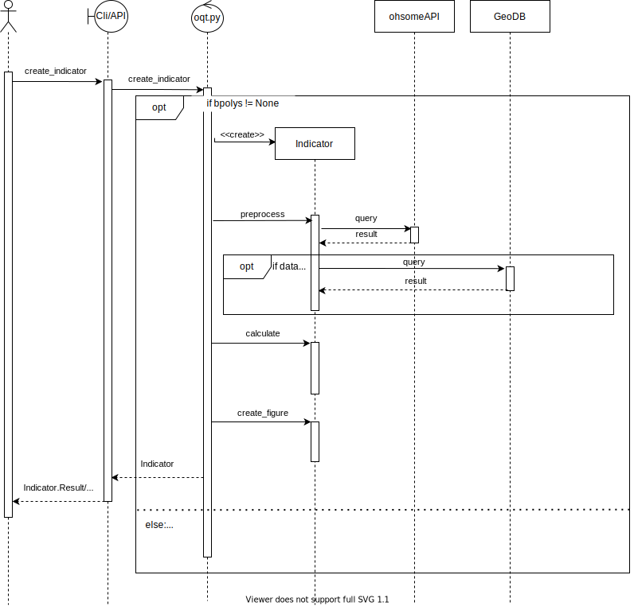

# Indicator Creation Guide

To make contributions to the OQT easier we have compiled this guide which explains the components and background knowledge that are needed to built an indicator.<br>
To understand how to implement your own indicator it is necessary to know a few things about how the BaseIndicator works and how it is composed. This will be covered in the first part. The second part will give further guidelines on how to implement your own Indicator.


## 1. BaseIndicator

To illustrate the structure of an indicator we created a Class Diagram showing it's most important components. 


As you can see the indicator you are trying to create should inherit from BaseIndicator. This class takes care of most of the needed functionality. The BaseIndicator is built from three elements: Result, Metadata and Layer, and some utility functions. The Metadata is automatically loaded from it's corresponding metadata.yaml (see part 2), the layer can be set during object creation and the result saves the result of an Indicator instance. 

### Result
The result object can hold 4 values. 

1. label: This should be a member of TrafficLightQualityLevels found in ohsome_quality_tool/utils/definitions
2. value: tbd
3. description: label description for TrafficLightQualityLevel (see metadata.yaml in part 2)
4. svg: unique file path which is created uppon object initialization

### Layer
If you need a custom layer from the ohsomeAPI you can specify new layers in ohsome_quality_tool/ohsome/layer_defintions.yaml. The layers are defined with 4 Attributes. A name and a description for documentation purposes and the ohsomeAPI [endpoint](https://docs.ohsome.org/ohsome-api/stable/endpoints.html) as well as [filters](https://docs.ohsome.org/ohsome-api/stable/filter.html) for functionality.

### Metadata
See metadata.yaml in part 2.

## 2. Your own Indicator

If you want to create an indicator you need to create **two** files in a folder named after your indicator which is placed in **ohsome_quality_tool/indicators** e.g. ohsome_quality_tool/indicators/your_indicator_name.

The two files are named:

1. **metadata.yaml**
2. **indicator.py**

### metadata.yaml

The metadata.yaml holds basic information about your indicator e.g. the indicator name, a quick description on what it does and how it works and a standartized interpretation of it's possible results.

The easiest way to setup the metadata.yaml the right way would be to copy it from another indicator and to replace the texts with your own. Just don't replace or change the category names.

### indicator.py

In your own indicator.py you only need to implement the three functions "preprocess", "calculate" and "create_figure" as well as an __init__ function which is called to create an instance of your indicator. The rest is working through inherited functionalities.

#### init
Your init should call the BaseIndicator init and thus should start like this:
```python
def __init__(
      self,
      dynamic: bool,
      layer_name: str,
      dataset: str = None,
      feature_id: int = None,
      bpolys: FeatureCollection = None,
  ) -> None:
      super().__init__(
          dataset=dataset,
          feature_id=feature_id,
          dynamic=dynamic,
          layer_name=layer_name,
          bpolys=bpolys,
      )
```

Additionally you can define variable placeholders for important values and preliminary results here.

#### preprocess

This function should be used to gather and preprocess the needed data for your indicator. Usually you will need to get the features specified in your layer through the **query** helper function which can be imported from **ohsome_quality_tool/ohsome/client**. This function can be called with a layer and a bounding-multipolygon and returns the resulting objects by calling the ohsomeAPI. If you need additional data, e.g. the population in an area, you should prepare it here too.

#### calculate

Here you should execute all needed calculations and save the results in your result object (**self.result.label, self.result.value and self.result.description**). 

#### create_figure

Finally you need to create a svg figure (e.g. with matplotlib) and save it to **self.result.svg** (e.g. plt.savefig(self.result.svg, format="svg")).


If you have defined these three functions your indicator is ready to go. To show how OQT uses your indicator to display on the OQT Website or in your command line interface we made a sequence diagram. 


