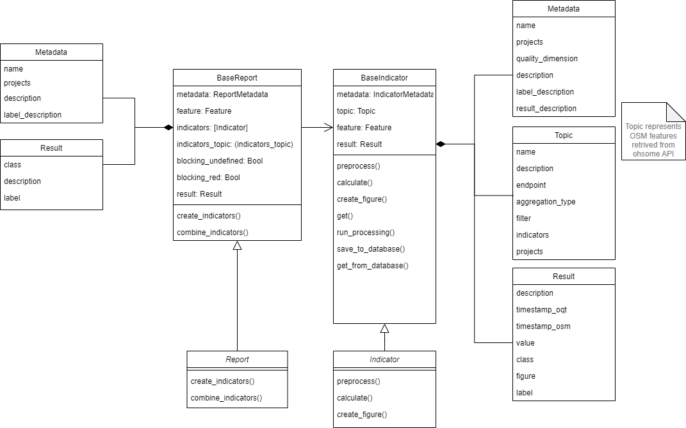
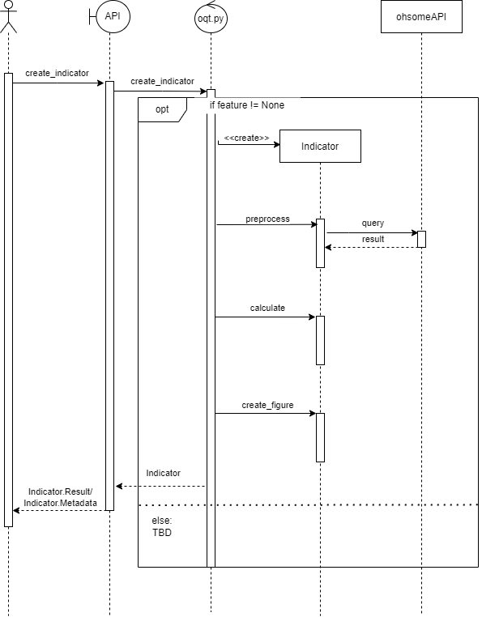

# Indicator Guide

To gain a deeper understanding of how OQT works, we have compiled this guide which explains the components and background knowledge of an indicator.<br>
The first part deals with the composition of the BaseIndicator which is the foundation of all indicators. The second part will give further information on how the individual indicators differ.


## 1. BaseIndicator

To illustrate the structure of an indicator we created a Class Diagram showing its most important components. 



As you can see, the indicators inherit from BaseIndicator. This class takes care of most of the needed functionality. The BaseIndicator is built from three elements: Result, Metadata and Topic, and some utility functions. The Metadata is automatically loaded from its corresponding metadata.yaml (see part 2), the topic is set during object creation, and the result saves the result of an Indicator instance.


### Result

The result object consists of following attributes:

- `description (str)`: The result description.
- `timestamp_oqt (datetime)`: Timestamp of the creation of the indicator
- `timestamp_osm (datetime)`: Timestamp of the used OSM data (e.g. the latest timestamp of the ohsome API results)
- `value (float)`: The result value
- `class (int)`: The result class. An integer between 1 and 5. It maps to the result labels: `1` maps to `red`, `2`/`3` map to `yellow` and `4`/`5` map to `green`.  This value is used by the reports to determine an overall result.
- `figure (dict)`: Figure of the result as plotly figure
- `label (str)`: Traffic lights like quality label: `green`, `yellow` or `red`. The value is determined by the result classes

### Topic

In the OQT we use the term Topic to describe the result of an ohsome API query. The Topics are defined in [ohsome_quality_analyst/topics/presets.yaml](/ohsome_quality_analyst/topics/presets.yaml) with several Attributes. A name and a description for documentation purposes, the ohsome API [endpoint](https://docs.ohsome.org/ohsome-api/stable/endpoints.html) as well as the [aggregation type](https://docs.ohsome.org/ohsome-api/stable/endpoints.html#elements-aggregation) and [filters](https://docs.ohsome.org/ohsome-api/stable/filter.html) for functionality. Furthermore, for each topic it is tagged which indicators can be used with this topic and to which project a topic belongs.


### Metadata

See metadata.yaml in part 2.


## 2. Differences of individual Indicators

For each indicator, at least **two** files in a folder named after the indicator are placed in **ohsome_quality_analyst/indicators** e.g. ohsome_quality_analyst/indicators/mapping_saturation.

The two files which are always present are named:

1. **metadata.yaml**
2. **indicator.py**


### metadata.yaml

The metadata.yaml holds basic information about the indicator e.g. the indicator name, for which project the indicator can be used, it's quality dimension, a quick description on what it does and how it works, and a standardized interpretation of its possible results.


### indicator.py

The indicator.py always has three functions implemented, named `preprocess`, `calculate`, and `create_figure` as well as an `__init__` function which is called to create an instance of the indicator. The rest is working through inherited functionalities.


#### \_\_init\_\_ function

The init calls the BaseIndicator init and thus starts like this:
```python
def __init__(
      self,
      topic: str,
      feature: str = Feature,
  ) -> None:
      super().__init__(
          topic=topic, 
          feature=feature
      )
```

Additionally, variable placeholders for important values and preliminary results can be defined here.


#### preprocess function

This function is used to fetch and preprocess the data needed for an indicator. Usually this involves querying the ohsome API by using the module `ohsome/client.py` which implements asynchronicity.

All data created during the preprocessing will be stored as attributes of the indicator object.


#### calculate function

Here all needed calculations are executed and the results saved in the result object (see part 1 which results are calculated). 


#### create_figure function

Finally, a plotly figure is created and saved as a dict to `self.result.figure`.


These three functions are implemented for each indicator, however, more functions specific for the respective indicator can be implemented. 

To show how OQT uses indicators, we made a sequence diagram. 


