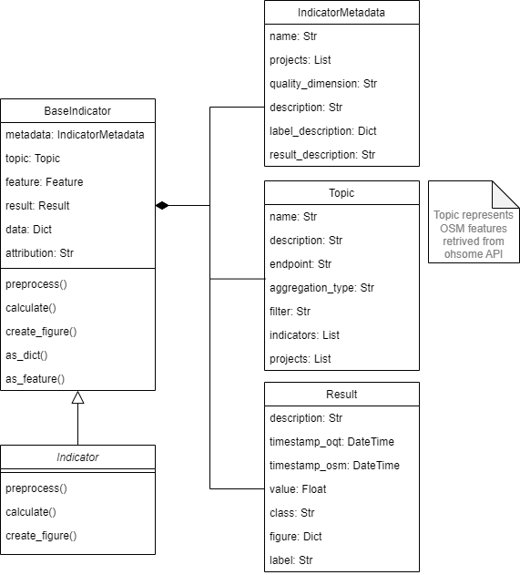

# Indicator

An indicator estimates data quality for OpenStreetMap (OSM). It takes an area of interest in form of a GeoJSON Feature and a Topic object describing the set of OSM features as input.

## Base Class

Each particular indicator class inherits from the `BaseIndicator` class of the `ohsome_quality_analyst/indicator/base.py` module. Following class diagram gives an overview of abstract methods and properties of this class:

### Metadata

Metadada is automatically loaded from a `metadata.yaml` file found in the module of a particular indicator.
Metadata describes basic information about the indicator: The indicator name, for which projects the indicator can be used, the quality dimension, a short description of what it does and how it works, and a standardized interpretation of its possible results.

### Topic

Please take a look at the [topic documentation](docs/topic.md).

### Result

The result object consists of following attributes:

- `description (str)`: The result description
- `timestamp_oqt (datetime)`: Timestamp of the creation of the indicator
- `timestamp_osm (datetime)`: Timestamp of the used OSM data (e.g. the latest timestamp of the ohsome API results)
- `value (float)`: The result value
- `class (int)`: The result class. An integer between 1 and 5. It maps to following result labels: 
    - `1`: `red`
    - `2`/`3`: `yellow`
    - `4`/`5`: `green`
- `figure (dict)`: A plotly figure
- `label (str)`: Traffic lights like quality label (`green`, `yellow` or `red`)

## Indicator Class

A particular indicator class (child) need to implement three functions:
1. `preprocess`
2. `calculate`
3. `create_figure` 

Following sequence diagram shows when those functions are called during the lifecycle of the indicator:

### `preprocess`

This function is used to fetch and preprocess the data needed for an indicator. Usually this involves querying the ohsome API by using the module `ohsome/client.py` which does so using Pythons async/await pattern

All data created during the preprocessing will be stored as attributes of the indicator object.

### `calculate`

This functions does the computation of the indicator. At the end the result object should be fully initialized and all attributes set (except the figure).

### `create_figure`

This function creates plotly figure base on the indicator result.
