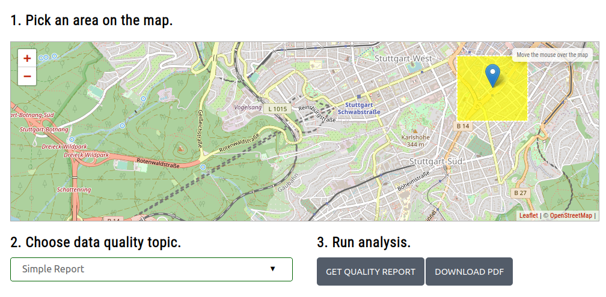
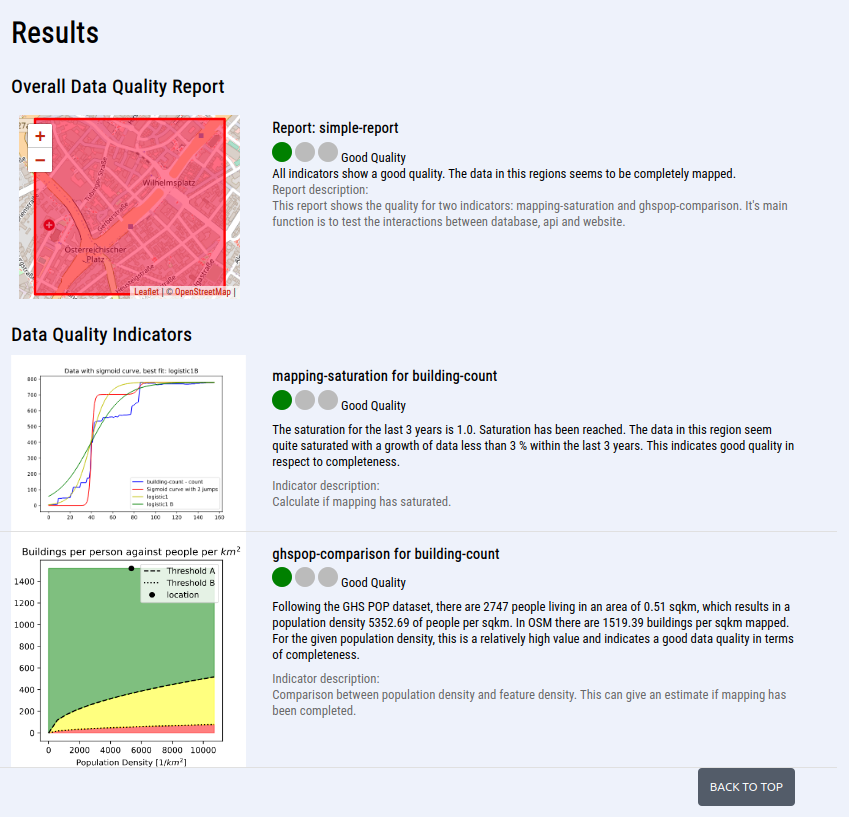

# Overview
This document should give you an overview on what is already implemented and works, and what is still missing and might 
come in future releases. It covers the following parts:

* Indicators
* Reports
* Website
* API
* Command Line Interface

## Indicators
So far we have implemented a few indicators which are either intrinsic, or rely on extrinsic data sets.

Extrinsic indicators:
* Global human settlement layer comparison
* Global urban footprint comparison

Intrinsic Indicators:
* Mapping saturation
* Points-of-interest density
* Last edit

Currently missing:
* Feature-based indicators, as so far all indicators are area-based, meaning they provide a quality estimation for a 
whole region and not for single OSM features

## Reports
So far we have implemented a few reports, which combine different sets of indicators. Currently, there are the following:
* Simple report
* Remote mapping report (buildings, roads)
* Sketch mapping report

## Website

[https://oqt.ohsome.org](https://oqt.ohsome.org)

The website relies on the OQT API. It is split up into two main parts:

### Website Part 1
First, the user needs to select an area of interest, and a respective data quality report. Currently, the set of
available geometries has been picked manually and is defined in a
[GeoJSON file](website/website/assets/data/test_regions.geojson).

The user can select one of the following reports, which are hardcoded in the [website code](website/website/index.html):
* Simple report
* Remote mapping report (buildings, roads)
* Sketch mapping report



### Website Part 2
The second part visualizes the results of the selected data quality report. This part is split up into two sub-sections:

* Overall data quality report (aggregated quality value based on all indicators)
* Data quality indicators (quality value for each indicator)



## API
The API can be accessed via this address: [https://oqt.ohsome.org/api](https://oqt.ohsome.org/api). 
There is also a [swagger documentation](https://oqt.ohsome.org/api/docs) available. 

Using the API one can either retrieve information on individual indicators, or on reports. This information is either
calculated from scratch, or fetched from a PostGIS database using pre-calculated values. This depends on whether a
dataset and feature id, or a custom input region is provided in the API query.

* `indicator/{name}` (GET and POST)
* `report/{name}` (GET and POST)

It is NOT possible to trigger the calculation of all indicators for all regions using the API.

## Command Line Interface
The command line interface offers the biggest flexibility. Using the CLI one can retrieve reports and 
indicators as well as trigger the calculation of all indicators for all regions.

One can get an overview on which functions are available when running:
```
$ oqt --help
Usage: oqt [OPTIONS] COMMAND [ARGS]...

Options:
  --version    Show the version and exit.
  -q, --quiet  Disable logging.
  --help       Show this message and exit.

Commands:
  create-all-indicators  Create all indicators for a specified dataset.
  create-indicator       Create an Indicator and print results to stdout.
  create-report          Create a Report and print results to stdout.
  list-datasets          List in the geodatabase available datasets.
  list-indicators        List available indicators and their metadata.
  list-layers            List available layers and how they are definied...
  list-reports           List available reports and their metadata.
```
